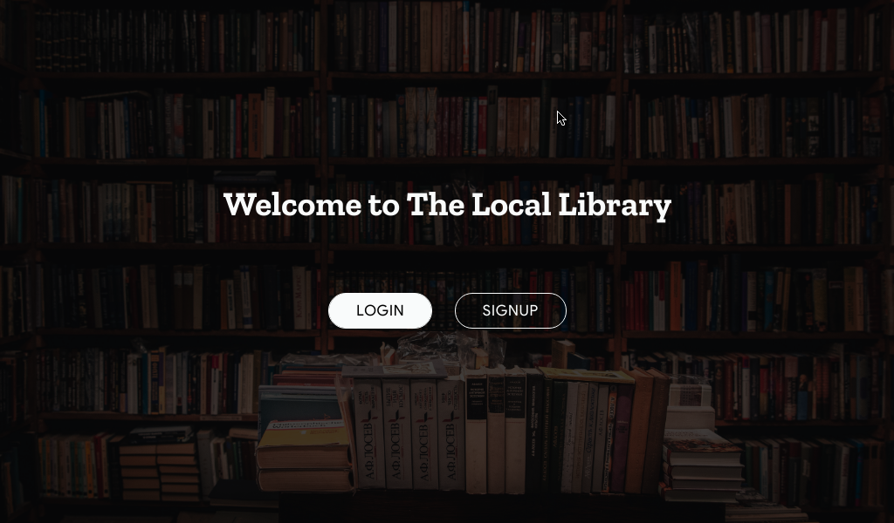

# django-locallibrary

Django locallibrary is a website that allows people to view books, authors and match different books to their
authors. Locallibrary is a company that doesn't exists.

- User authentication (using email)
- Signup and Login Forms
- Decent design

In order to access the site functionality you have to login which is not possible if you haven't signed in.
For the sake of demonstration if you want only to see how the site functions without testing how signup form works
you can login with __email: test@locallibrary.edu and password: abJK56!@jd__

To view the live demo of the app on heroku, please visit [https://guarded-wildwood-71414.herokuapp.com/](https://guarded-wildwood-71414.herokuapp.com/)
